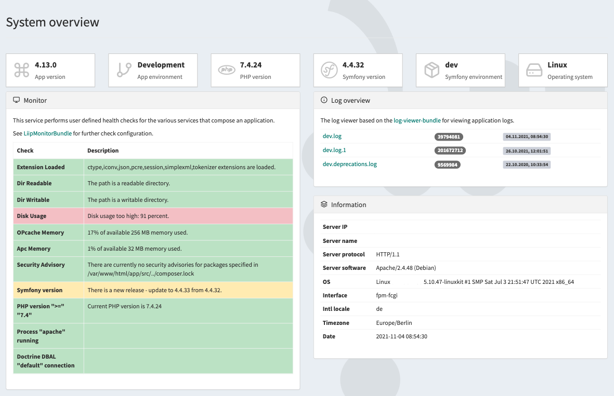

# System Information Bundle

Simple Sonata Admin bundle to get a system information overview. 



This bundle combines the functionalities of the following bundles and displays the aggregated information within the backend:

- [LiipMonitorBundle](https://github.com/liip/LiipMonitorBundle)
- [log-viewer-bundle](https://github.com/evotodi/log-viewer-bundle)

## Install

Install bundle via composer
```bash
$ composer require kmi/system-information-bundle
```

Add a routing entry in `config/routes/kmi_system_information.yaml`
```yaml
kmi_system_information:
  resource: "@SystemInformationBundle/Resources/config/routing.yaml"
```

Add a service entry in `config/services.yaml`
```yaml
imports:
    - { resource: "@SystemInformationBundle/Resources/config/services.yaml" }
```

Add a twig entry in `config/packages/twig.yaml`
```yaml
paths:
  '%kernel.project_dir%/vendor/kmi/system-information-bundle/src/Resources/views': SystemInformationBundle
```

Add a sonata admin menu entry in `config/packages/sonata_admin.yaml`
```yaml
groups:
    app.admin.group.system:
        label: 'System'
        icon: '<i class="fa fa-cogs" aria-hidden="true"></i>'
        roles: ['ROLE_SUPER_ADMIN']
        on_top: true
        items:
            - route: kmi_system_information_overview
              label: System
```

Install assets
```bash
$ php bin/console assets:install
```

Configure [LiipMonitorBundle](https://github.com/liip/LiipMonitorBundle) in `config/packages/monitor.yaml`.
See an example in [monitor.yaml](docs/examples/monitor.yaml)

Access the system overview page `/admin/system`.