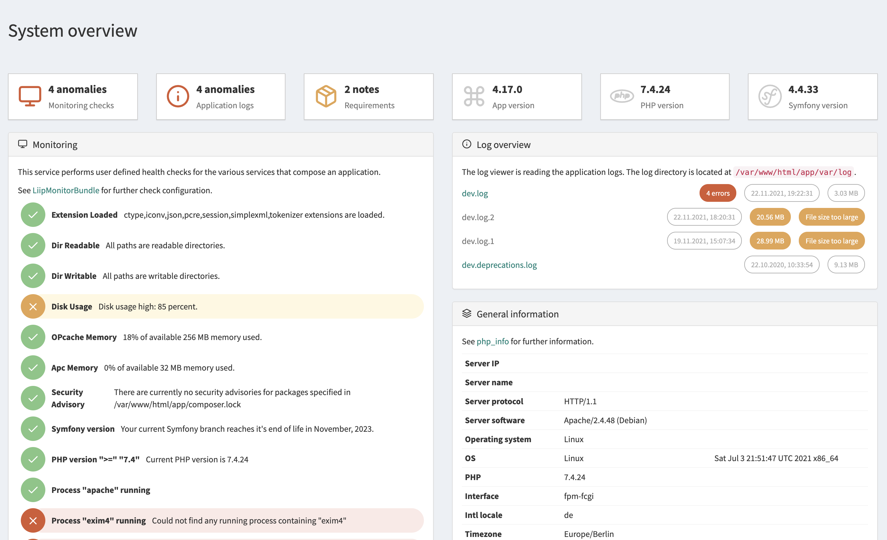
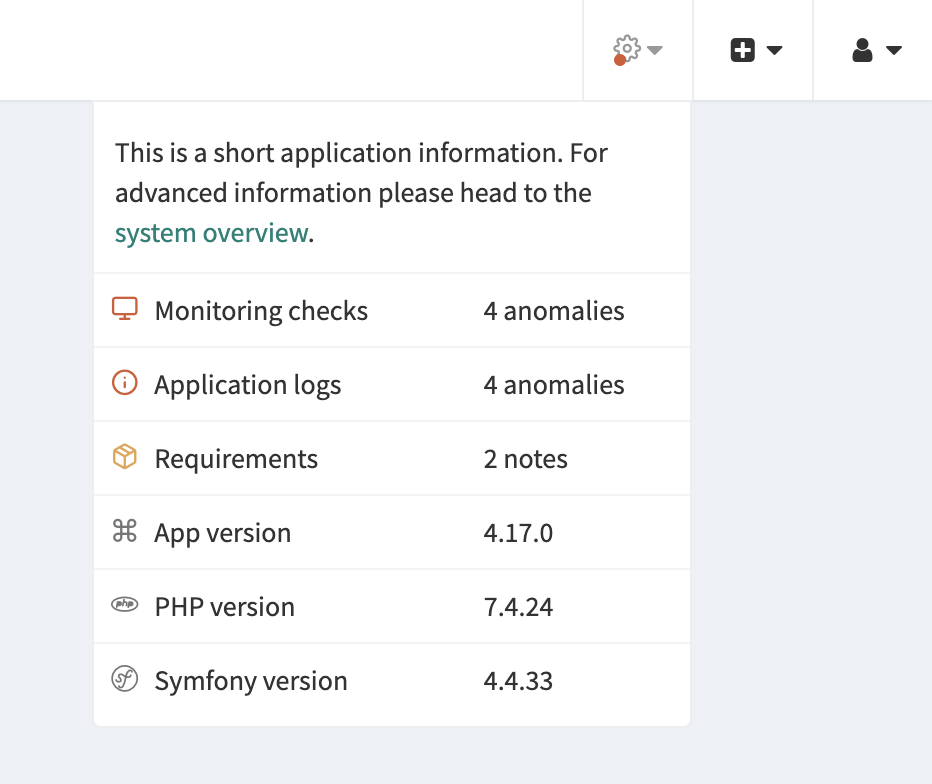
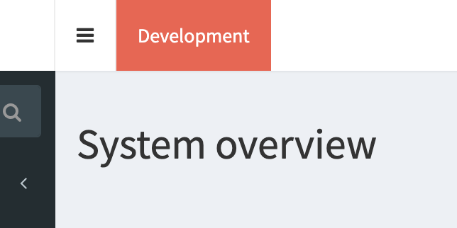

<h1 align="center">System Information Bundle</h1>

<p align="center"></p>

Simple Sonata Admin bundle to get a system information overview. 



This bundle combines the functionalities of the following bundles and displays the aggregated information within the backend:

- [LiipMonitorBundle](https://github.com/liip/LiipMonitorBundle)
- [Symfony Requirements Checker](https://github.com/symfony/requirements-checker)

## Install

Follow the steps to enable the system information overview in the sonata backend.

### Composer

Install bundle via composer
```bash
$ composer require kmi/system-information-bundle
```

### Routing

Add a routing entry in `config/routes/kmi_system_information.yaml`
```yaml
kmi_system_information:
  resource: "@SystemInformationBundle/Resources/config/routing.yaml"
```

Extend the file with the routing definition of the LiipMonitorBundle
```yaml
_monitor:
  resource: "@LiipMonitorBundle/Resources/config/routing.xml"
  prefix: /monitor/health
```

### Templates

Add a twig entry in `config/packages/twig.yaml`
```yaml
paths:
  '%kernel.project_dir%/vendor/kmi/system-information-bundle/src/Resources/views': SystemInformationBundle
```

### Sonata Admin Menu

Add optionally a sonata admin menu entry in `config/packages/sonata_admin.yaml` or use the system indicator twig extension (see below)
```yaml
sonata_admin:
    dashboards:
        groups:
            app.admin.group.system:
                label: 'System'
                icon: '<i class="fa fa-cogs" aria-hidden="true"></i>'
                roles: ['ROLE_SUPER_ADMIN']
                on_top: true
                items:
                    - route: kmi_system_information_overview
                      label: System
```

### Assets

Install the bundle assets
```bash
$ php bin/console assets:install
$ php bin/console cache:clear
```

### Register checks

Configure [LiipMonitorBundle](https://github.com/liip/LiipMonitorBundle) in `config/packages/monitor.yaml`.

See an example in [monitor.yaml](docs/examples/monitor.yaml)

### Ready

Access the system overview page `/admin/system`.

## Twig Extensions

The bundle comes with several twig extensions

### System Indicator

The system indicator twig extension gives you a short overview about the system status in the sonata header:



Extend the Sonata Admin `standard_layout.html.twig` to enable the twig function in the backend header:

```html

    <div class="navbar-custom-menu">
        <ul class="nav navbar-nav">
            <li>
                {{ system_information_indicator()|raw }}
            </li>
        </ul>
    </div>

```

### App Version

Displays the application version defined in the `composer.json` file:

```html
{{ version() }}
```

### Environment Indicator

The environment indicator gives you a fast indicator about the current environment:





Extend the Sonata Admin `standard_layout.html.twig` to enable the twig function in the backend header:

```html


    <ul class="nav navbar-nav" style="float:left">
        {{ environment()|raw }}
    </ul>
    {{ parent() }}

```

Extend the Sonata User `login.html.twig` to enable the twig function in the login screen:

```html



    {{ parent() }}
    <ul style="position: absolute;top: 10px;left: 10px;">
        {{ environment()|raw }}
    </ul>

```